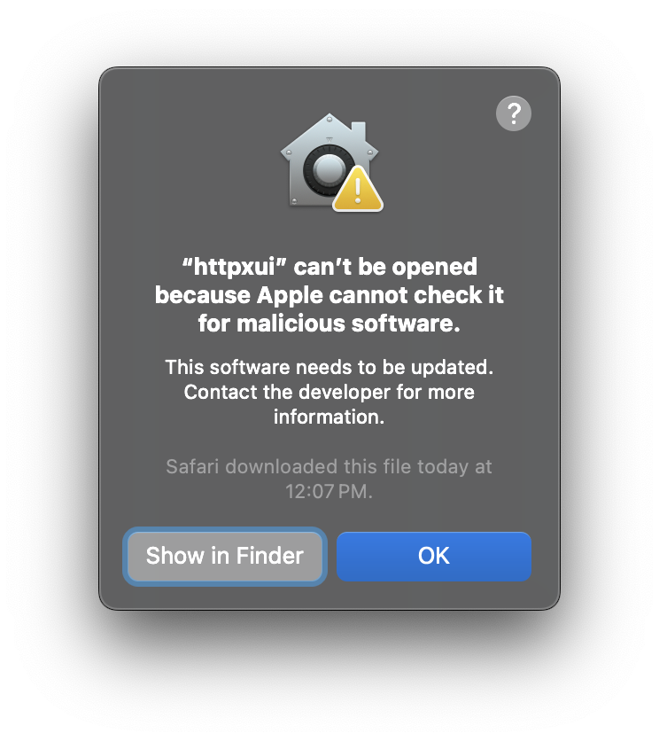

# HTTPXUI

HTTPXUI is an HTTP flyover tool based on the [httpx](https://github.com/projectdiscovery/httpx) library by ProjectDiscovery. It intends to optimize flyovers by performing (nearly all) HTTP probes and screenshotting while persisting the results for tracking, searching, and future reference of your reconaissance activity.

## Features

- All data is persisted *locally* to your system in a SQLite database

**Run**
- Start a new run of `httpx` by configuring targets, paths, ports, request methods, and other `httpx` parameters


**Sessions**
- An overview of current and completed runs of `httpx` showing start and end times, and number of live endpoints


**Session Details**
- View completed runs of `httpx` in either a searchable table or a screenshot grid
- Search for specific technologies, response codes, content lengths, content types, response times, titles, and other response data
- Ignore visually similar screenshots in the screenshot grid view


**Endpoint-Level Details**
- Inspect endpoint-level information such as IP addresses, ASN, TLS certificate, and technology stack
- Store notes about a particular endpoint
- Set a status on the endpoint to keep track of your reconnaissance activity


**Settings**
- Configure an HTTP proxy, custom HTTP headers, and custom DNS resolvers


## Installation Instructions

> [!NOTE]  
> If you are a Linux user, ensure `libgtk-3-dev` and `libwebkit2gtk-4.0-dev` are installed

1. Download one of the latest prebuilt binaries from GitHub [Releases](https://github.com/mattzajork/httpxui/releases/latest)

2. Upon running the application for the first time, a SQLite database will be created in one of the following locations depending on your operating system:

| OS | Path(s) |
| --- | --- |
| Linux | `$XDG_CONFIG_HOME/httpxui/pb_data or $HOME/.config/httpxui/pb_data` |
| macOS | `$HOME/Library/Application Support/httpxui/pb_data/` |
| Windows | `%APPDATA%\httpxui\pb_data\` or `C:\Users\%USER%\AppData\Roaming\httpxui\pb_data\` |

> [!NOTE]  
> By default, the backend webserver listens on `127.0.0.1:8081`. This can be changed by modifying the source code. Run the following Linux / MacOS command to change the default port in the relevant files:

```shell
rg --no-heading -o '127.0.0.1:8081' | cut -d ':' -f1 | xargs -I {} sed -I '' 's/127\.0\.0\.1:8081/127.0.0.1:8082/' {}
```

## Building from Source Code

If you prefer to build from the source code, follow these steps:

1. First, ensure that your system has the following required development dependencies:

- [Go](https://go.dev)
- [npm](https://github.com/npm/cli)
- [Wails](https://github.com/wailsapp/wails)

2. Next, clone this repository

```shell
git clone https://github.com/mattzajork/httpxui.git
```

3. Then, install the frontend dependencies

```shell
cd frontend && npm i
```

4. Finally, build the application

```shell
cd .. && wails build
```

## Management Console 

The backend webserver is [PocketBase](https://pocketbase.io). You may access the PocketBase management console on your local system (while the application is running) by navigating to [http://127.0.0.1:8081/_/](http://127.0.0.1:8081/_/) (or via your custom-specified port). The default credentials are:

```
httpxui@localhost.localdomain:kuideiL7zo
```

## Note About Windows and MacOS Binaries

The builds in this repository are not signed with production or developer certificates, so Windows and MacOS may flag them as malicious, which requires an additional steps to be able to execute them. Alternatively, you may build from source code to avoid this problem altogether.

### MacOS Binary

When attempting to run the MacOS silicon binary and the following error is encountered, use the below workaround:

[](static/macos-httpxui-cannot-be-opened.png)

Right-click the application and select **Open**.

[](static/macos-httpxui-right-click-open.png)

Click **Open** once again.

[](static/macos-httpxui-force-open.png)

> [!NOTE]  
> Alternatively, build and run from source code to avoid the above error.

### Windows Binary

When attempting to run the Windows binary and the following error is encoutered, use the below workaround:

Select **More Info**

[](static/windows-more-info.png)

Click **Run Anyway**

[](static/windows-run-anyway.png)

Additionally, you may need to allow the following:
[](static/windows-security-allow.png)

> [!NOTE]  
> Alternatively, build and run from source code to avoid the above error.

## Acknowledgement

https://github.com/projectdiscovery/httpx
